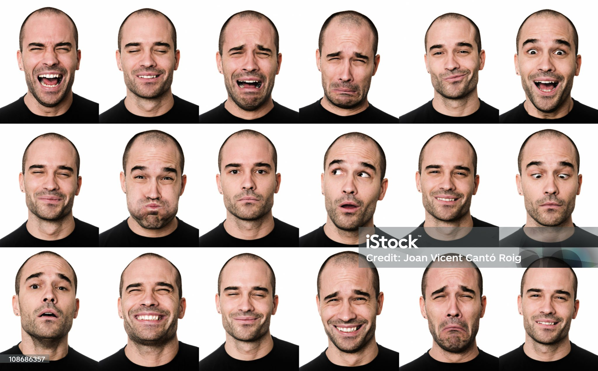
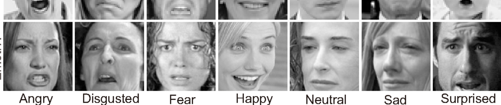

# *Expressões com Machine Learning*


---

## Proposta

> Aqui utilizo IA para tentar descobrir quem matou Odete. Utilizando Machine Learning e análise emocional. Gerando um ranking de suspeitos



---

## Tecnologias Utilizadas

> Python (Linguagem Principal)
>
> Pandas (Biblioteca de manipulação e anáise de dados)
>
> Matplotlib (Permite criar gráficos e imagens para representar as emoções e os rankins)
>
> KaggleHub (Download automático do dataset FER-2013 com expressões faciais)
>
> numpy (Ajuda Python a  fazer contas com velocidade, pesquisando vi que dataset FER-2013 traz os pixels como uma  **string de números** . NumPy transforma isso em uma imagem real

---

## Dataset Utilizado

Para simular emoções, utilizei o dataset  **FER-2013 (Facial Expression Recognition 2013)** , que contém milhares de imagens de rostos humanos rotulados com emoções como: raiva, nojo, medo, felicidade, tristeza, surpresa, neutro.

📥  **Fonte do dataset** :
O dataset foi baixado diretamente do Kaggle usando a biblioteca `kagglehub`.
Link oficial: [https://www.kaggle.com/datasets/msambare/fer2013](https://www.kaggle.com/datasets/msambare/fer2013)



---

## Como rodar o projeto?

Clone o repositório:

```bash
   git clone https://github.com/seu-usuario/quem-matou-odete.git
   cd quem-matou-odete
```

Instale as dependências:

```bash
  pip install -r requirements.txt
```
# express-es-com-machine-learning
